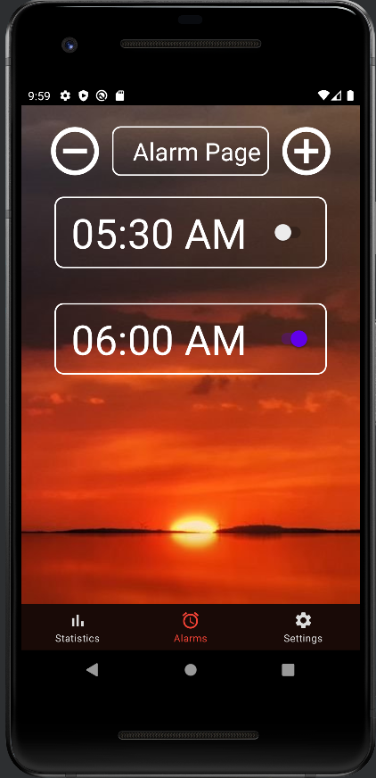

# RiseNGrind

RiseNGrind is a mobile application designed to reimagine the way people wake up, by taking away the “abruptness” of waking up, and attempting to harness the ability to make it nature again. Our product provides two unique traits: the trait of a gradual wakeup and the trait of freedom.

With a gradual wakeup, the application’s alarm starts softly and gradually crescendos to a user-set volume.

Alarm clock manufacturers and mobile applications also in-a-way dictate the way we wake up in the morning by giving users a set way to turn off the alarm and a set list of sounds to choose from. Our application will give users the freedom to record custom sounds to wake up too as well as give users the freedom to wake up in a variety of ways, including: pressing a button, turning on a light, walking, or shaking the phone.

### Competitive Analysis

Many alarm applications already exist to help a user wake up at a certain time in the morning. One of the most popular apps is `Rise` due to the ability to easily set alarms with your own custom alarm sounds. The Rise app, like most alarm clock apps, does not do much to help the user actually wake up and get out of bed. Our app, RiseNGrind, will be designed to help even the most heavy sleeper wake up and get out of bed in the morning. We attempt to accomplish this by having the user perform some sort of physical activity in the morning such as walking a certain distance, dancing/shaking the phone, or even simply getting up to turn on the lights. There are some alarm apps that do things similar to what we plan for RiseNGrind to do such as `Walk Up Alarm Clock` or `Wake N Shake`, however, we also plan to include additional features to separate our apps from those and attract more users. Some of these features include a progressive wakeup feature that can help the user train their body to wake up at an earlier target time, and some wake up statistics to show the user their best and average wake up times.

### Technical Anaylsis

**What are the features of the phone and/or Android that will be used?**

- For determining if the user is shaking the device we intend to use an accelerometer
- We intend to use environmental systems to determine the light levels in the room to check if a user has turned on the lights.
- We also intend to use a microphone to allow the user to record unique audio for their alarm sounds
- A step counter sensor will be used to determine the number of steps a user has taken
  **Why and how will data be stored?**
- We plan to use a database to store any user statistics and internal storage for any custom wake up sounds the user uploads/records
  **What functionality does your app present to an end user?**
- The main functionality our app presents users is a unique and possibly fun way to wake them up in the morning. Our app targets both light and heavy sleepers by providing wake up options that range from simply turning off the alarm by the press of a button to a physical activity that would wake even the most heavy of sleepers

### How to Build

1. Install Android Studio
2. Download the Zip Version of this application, extract the contents into a directory of your choosing.
3. Utilize a Device with `API Version 29`

### Screenshots of the Application

